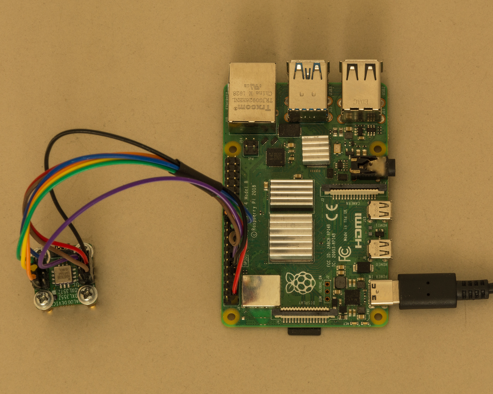
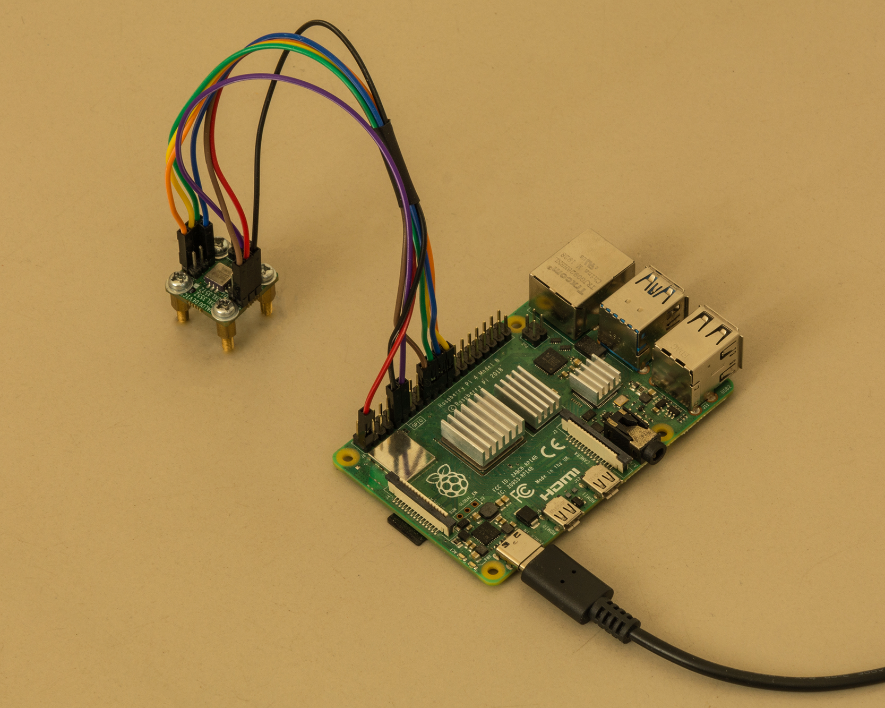
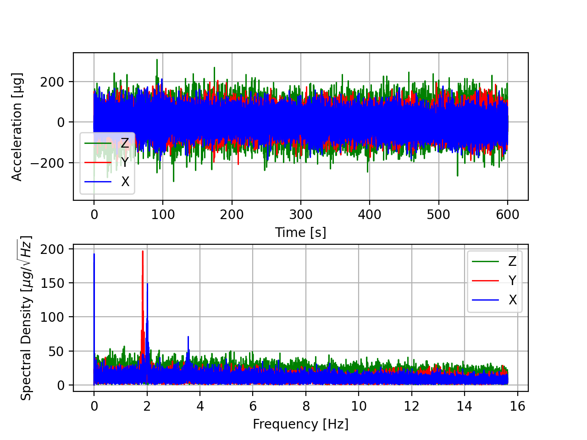
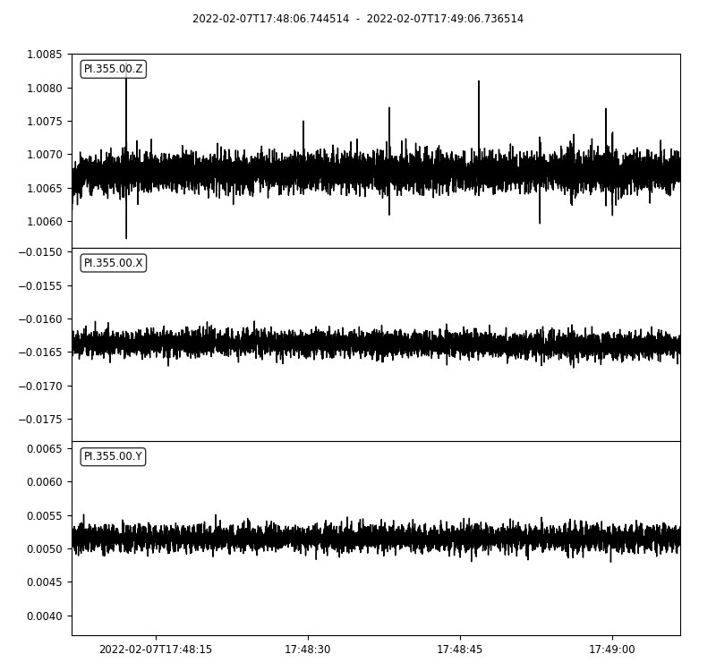

# PiADXL355
Python module for interfacing Analog Devices ADXL355 accelererometer through SPI bus with the Raspberry Pi.

All you need is Raspberry Pi 4, SD card, sensor board and some jumper wires.

Module uses data ready pin for accurate sampling rate. ODR values given in datasheet can be used as a sampling rate.

Files are writen to miniSEED file format with header information. 

Notes:

Maximum tested data rate is 500 SPS.

Expect some time drift with this version :)

----------------------------------------------------------------------------------

Examples are tested with ADXL355Z evaluation board and Raspberry Pi 4 Model B 4gb version

[ADXL355 Datasheet](https://www.analog.com/media/en/technical-documentation/data-sheets/adxl354_355.pdf)

[ADXL355Z Eval Board](https://www.analog.com/media/en/technical-documentation/user-guides/eval-adxl354-355-ug-1030.pdf)

Wiring of ADXL355 to Raspberry Pi 
| ADXL355 Pin | Description | Raspberry Pin |
|:------------:|:------------:|:------------:|
| 1 (Vddio) | 3.3V Digital Power | 1 |
| 3 (Vdd) | 3.3V Digital Power | 1 |
| 5 (Gnd) | Ground | 9 |
| 6 (Drdy) | Data Ready | 11 |
| 8 (Cs) | Chip Select | 24 |
| 10 (Sclk) | Serial Clock | 23 |
| 11 (Miso) | Master In Slave Out | 21 |
| 12 (Mosi) | Master Out Slave In | 19 |

----------------------------------------------------------------------------------

Example 2 - Read acceleration and plot Spectral Density of the record.

----------------------------------------------------------------------------------

Example 3 - Write acceleration data to Mini-SEED file.

